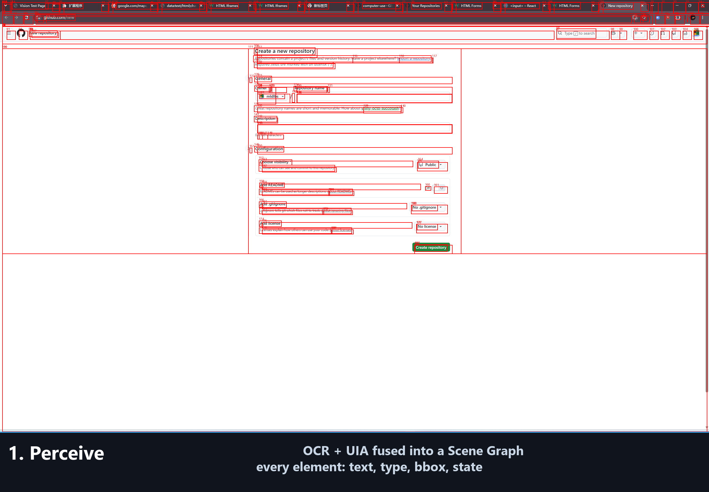

<p align="center">
  
</p>

<h1 align="center">mio-cua</h1>

<p align="center">
  <b>Give your AI eyes, not APIs.</b><br/>
  A computer-use agent that sees your Windows screen and operates any app — just like a human.
</p>

<p align="center">
  <a href="https://github.com/mldlbs/mio-cua/stargazers"></a>
  <a href="https://github.com/mldlbs/mio-cua"></a>
  
  
</p>

---

## What is mio-cua?

Most software has **no API**. Yet it still gets operated every day — by humans looking at a screen and clicking.

mio-cua flips the approach: instead of writing an interface for the AI, it gives the AI **eyes**. It sees the screen (OCR + vision), understands the UI, and operates the real mouse and keyboard — **with an interface, anything is automatable**.

`有界面就能自动化` — if you can see it on screen, mio-cua can operate it.

**One-line pitch:** Tell it in plain language what to do. It watches the screen, decides, and clicks.

---

## ✨ Highlights

- 🧠 **Scene Graph perception** — OCR + UIA fused into a *scene graph*: every UI object is a node (text / type / state / bbox) with spatial relations, and the LLM picks from **verified action candidates** instead of guessing coordinates.
- 🌐 **Web without DOM** — a browser tab is understood purely visually (Regions layout + OmniParser). No browser extension, no page source, no plugin.
- 🔁 **Cross-app workflows** — read a file → compute in Calculator → save the result. One natural-language task spanning multiple apps.
- 🧩 **MCP server included** — 27 tools exposed; plug it into Claude, Cursor, or ChatGPT and let your assistant control your desktop.
- 🔒 **Safe by design** — F9 emergency stop, step/time limits, screenshot-per-step artifacts, `--dry-run`, and optional isolated virtual-desktop testing.

---

## 🚀 Quick Start

### 1. Install

```bash
pip install mio-cua          # core (Windows; run terminal as admin recommended)
pip install "mio-cua[vision]" # + OCR (rapidocr)
pip install "mio-cua[gpu]"    # + DirectML GPU acceleration
```

> Dev install from source instead: `pip install -e .` (add `-e ".[vision]"` / `-e ".[gpu]"` for extras).

### 2. Set your LLM key

```powershell
$env:OPENAI_API_KEY = "sk-xxx"
```

### 3. Run your first task

```bash
mio-cua run "打开记事本，输入 hello world 并保存"
mio-cua run "打开计算器，计算 3*4"
mio-cua run "整理桌面上散落的文件，按类型归档"   # works with any OpenAI-compatible model
```

---

## 📸 Demo



> Frames are real artifact screenshots from the verified Calculator run (`123*456=56088`). Regenerate with `python scripts/make_demo_gif.py`. First-frame OCR ~20s on the web vision path; ~1.6s per OCR step with GPU.

Verified end-to-end on a real Windows 11 desktop:

| Scenario | What it does | Result |
|---|---|---|
| Notepad | Open, type `hello world`, save | ✅ PASS |
| Calculator | `123 * 456 = 56088` | ✅ PASS |
| Explorer | Create folder, rename it | ✅ PASS |
| Cross-app | Read file → Calculator sum (102) → save result | ✅ PASS |
| Web | Open a local page, click & type, purely visually (no DOM) | ✅ PASS |

Run the full suite yourself on an isolated virtual desktop:

```bash
python scripts/run_smoke_vdesk.py --only calculator,crossapp,explorer,notepad,web \
  --model deepseek-v4-flash --base-url https://api.deepseek.com/v1
```

Low-cost models (e.g. `deepseek-v4-flash`) are enough for all five scenarios.

---

## 🧑‍💻 Usage

### CLI

```bash
mio-cua run "打开计算器，计算 3*4" --model gpt-4o
mio-cua run "删除所有文件" --dry-run        # plan only, nothing is touched
mio-cua gen-scenario --image shot.png -o calculator.yaml   # screenshot -> YAML scene
mio-cua run "计算 3*4" --simulate-scenario calculator.yaml  # replay offline, no real input
mio-cua resume <task_id>                     # continue an interrupted task
mio-cua replay <task_id>                     # debug: replay every step from artifacts
mio-cua providers
```

### SDK

```python
from mio_cua import Agent, AgentConfig, Task

agent = Agent(AgentConfig(model="gpt-4o", max_steps=50))
result = agent.run(Task(instruction="打开记事本，输入 hello"))
print(result.status, result.steps)
```

### MCP — plug into your favorite AI

Add to Claude / Cursor / ChatGPT (MCP-capable clients):

```json
{ "mcpServers": { "mio-cua": { "command": "mio-cua-mcp", "args": [] } } }
```

27 tools: file ops (`list_dir` / `make_dir` / `move_file` / `move_files`), windows (`launch` / `focus_window` / `get_active_window`), input (`click` / `type` / `key`), plus `observe_scene`, `analyze_page`, `vdesk`, clipboard, processes and more. See [MCP.md](MCP.md).

### Docs

- [Quick Start (English)](docs/tutorial-en.md) — first task in ~5 minutes
- [MCP.md](MCP.md) — MCP server setup & full tool reference

---

## 🔍 Why not just RPA / accessibility-only agents?

| | Traditional RPA (UiPath…) | Accessibility-only agents | **mio-cua** |
|---|---|---|---|
| Setup | Drag-drop flows, nodes, scripts | Depends on apps exposing UIA/AT-SPI | Install + one sentence |
| UI change | Flows break, must be rebuilt | Selectors go stale | Re-reads the screen every step |
| Web automation | Needs plugins/extensions | Needs DOM | **Pure vision — no DOM** |
| Cross-app | Per-flow configuration | Partial | One task, many apps |
| Cost | Licensed, heavy | — | Runs on cheap models |

Traditional RPA automates *the flow you script*. mio-cua automates *what you describe*.

---

## 🧠 How it works

1. **Perceive** — fuse OCR + UIA into a Scene Graph (every element: text / type / state / bbox / relations / verified action candidates).
2. **Decide** — the LLM picks from *candidate actions* the perception already validated (no guessing coordinates).
3. **Act** — real mouse / keyboard input; every step screenshot is saved (overlay numbering maps to element ids).
4. **Verify** — `Scene Diff` confirms the screen actually changed (`0` → `7` on the calculator display), and `Recovery` retries a failed action after re-focusing the window.

**One action, one perception** — actions never run on a stale scene. Up to 3 tightly-related actions per plan are batched with a lightweight screen re-verification between each; anything else re-reads the screen before deciding, so actions never run on a stale scene.

---

## 🔒 Safety

- **F9 emergency stop** during any run
- Step limits / task timeouts
- Screenshot-per-step audit trail (`~/.mio_cua/artifacts/`)
- `--dry-run` to preview plans without executing
- File moves refuse to overwrite existing files
- High-risk actions (delete / kill / close) ask for **on-screen confirmation** before running (`MIO_CUA_CONFIRM_OFF=1` to disable)
- Test scenarios run in an **isolated virtual desktop** — your real desktop is untouched

> ⚠️ Run a small smoke task first (e.g. "open Notepad, type hello") and confirm F9 works. It moves your real mouse and keyboard.

---

## 🗺️ Roadmap

- [x] **Demo GIF + screenshots** in README ✅
- [x] **Planner improvements: multi-step batching with live re-verification** ✅ (v0.2)
- [x] **On-screen notification + confirmation for high-risk actions** ✅ (v0.2)
- [x] **Screenshot → YAML scenario** + offline replay ✅ (v0.2)
- [x] **CHANGELOG** ✅
- [ ] Publish to PyPI (`pip install mio-cua`) — build & twine upload pending
- [ ] Linux / macOS support (vision-only fallback)
- [ ] Community: Discord/WeChat group (issues + CONTRIBUTING are live)

---

## 🤝 Contributing

Found a bug, or an app it can't operate yet? Open an issue or PR — every new scenario added to `smoke/` is a win for everyone. See [CONTRIBUTING.md](CONTRIBUTING.md) for the workflow, safety rules, and how to add smoke scenarios.

---

## 📄 License

[MIT](LICENSE).

<sub>Made with 🖥️ for the Windows desktop. `server.json` also published to the MCP Registry as `io.github.mldlbs/mio-cua`.</sub>
