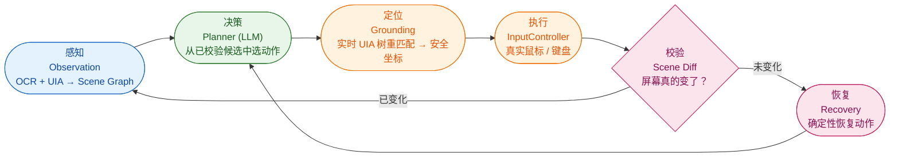

<p align="center">
  
</p>

<h1 align="center">mio-cua</h1>

<p align="center">
  <b>给 AI 眼睛，而不是接口。</b><br/>
  一个能「看」你的 Windows 屏幕、并像人一样操作任意软件的电脑使用智能体（computer-use agent）。
</p>

<p align="center">
  <a href="https://github.com/mldlbs/mio-cua/stargazers"></a>
  <a href="https://github.com/mldlbs/mio-cua"></a>
  
  
  
</p>

---

## 现状指标（实测）

| 项 | 值 |
|---|---|
| 版本 | `0.3.0`（`pyproject.toml` / `server.json`） |
| 平台 | Windows 10+（依赖 `pywin32` / `pywinauto` / `pynput`） |
| 模型接入 | OpenAI 兼容端点（单一 provider：`openai`；默认 `gpt-4o`） |
| 对外能力 | CLI（6 个子命令）+ MCP server（**36** 个工具，stdio 传输） |
| 代码规模 | `mio_cua/` 下 **102** 个 `.py` 文件 / **约 12,087** 行 |
| 测试 | **59** 个测试文件 / **468** 个用例（详见「开发」节） |
| 发布状态 | 源码安装 `pip install -e .`；已构建 `dist/*.whl` 与 `*.tar.gz`；**尚未上传 PyPI**（见「已知限制」） |

> ⚠️ **安装方式更正**：README 旧版写 `pip install mio-cua`，但 PyPI 发布仍是 `Unreleased` 待办项（见 `CHANGELOG.md`），当前 **PyPI 上还没有该包**。请改为从源码安装，见下方「快速开始」。

---

## 目录

1. [它解决什么问题](#1-它解决什么问题)
2. [核心架构与能力](#2-核心架构与能力)
3. [快速开始](#3-快速开始)
4. [CLI 用法](#4-cli-用法)
5. [MCP 接入（让 AI 控制你的桌面）](#5-mcp-接入让-ai-控制你的桌面)
6. [配置项](#6-配置项)
7. [安全机制](#7-安全机制)
8. [实验与可观测性（Phase 3）](#8-实验与可观测性phase-3)
9. [开发](#9-开发)
10. [已知限制](#10-已知限制)

---

## 1. 它解决什么问题

大多数软件**没有 API**，但每天仍被人看着屏幕、点着鼠标在操作。mio-cua 反过来：不给 AI 写接口，而是给 AI **眼睛**——它「看」屏幕（OCR + UIA 融合），理解界面，再操作真实的鼠标键盘。**有界面，就能自动化。**

**一句话定位**：用自然语言告诉它做什么，它看屏、决策、点击。

典型痛点：

- **无 API 的闭源软件** —— 人能操作，RPA 接不进。mio-cua 用视觉直接驱动。
- **跨应用工作流** ——「读文件 → 计算器算 → 存结果」一句话跨多个 App。
- **UI 频繁变动** —— 传统 RPA 选择器一变就失效；mio-cua 每一步重新读屏，不依赖固定坐标。

```
        自然语言指令
            │
            ▼
   ┌─────────────────┐
   │  Perceive 感知   │  OCR + UIA → Scene Graph（元素/类型/状态/bbox/关系）
   └────────┬────────┘
            ▼
   ┌─────────────────┐
   │  Decide 决策     │  LLM 从「已校验的动作候选」中选，不猜坐标
   └────────┬────────┘
            ▼
   ┌─────────────────┐
   │   Act 执行       │  真实鼠标/键盘；每步截图存证
   └────────┬────────┘
            ▼
   ┌─────────────────┐
   │ Verify 校验      │  Scene Diff 确认屏幕真的变了 → 否则 Recovery 重试
   └────────┬────────┘
            │
            └──── 回到 Perceive（绝不基于过期场景执行）
```

---

## 2. 核心架构与能力

**四阶段闭环（Perceive → Decide → Act → Verify）** 之上，v0.3 叠加了「去模型化」确定性层，让 A/B 实验有可开关变量：


```mermaid
flowchart LR
    O(["感知<br/>Observation<br/>OCR + UIA → Scene Graph"]):::per
    P(["决策<br/>Planner (LLM)<br/>从已校验候选中选动作"]):::dec
    G(["定位<br/>Grounding<br/>实时 UIA 树重匹配 → 安全坐标"]):::act
    I(["执行<br/>InputController<br/>真实鼠标 / 键盘"]):::act
    V{"校验<br/>Scene Diff<br/>屏幕真的变了？"}:::ver
    R(["恢复<br/>Recovery<br/>确定性恢复动作"]):::ver

    O --> P --> G --> I --> V
    V -->|未变化| R --> P
    V -->|已变化| O

    classDef per fill:#e3f2fd,stroke:#1565c0,color:#0d47a1
    classDef dec fill:#e8f5e9,stroke:#2e7d32,color:#1b5e20
    classDef act fill:#fff3e0,stroke:#ef6c00,color:#e65100
    classDef ver fill:#fce4ec,stroke:#c2185b,color:#880e4f
```

- **Scene Graph 感知** —— OCR + UIA 融合成场景图：每个 UI 元素是节点（文本/类型/状态/bbox/空间关系），LLM 从**已校验的动作候选**中选，而非猜坐标。
- **Web 无需 DOM** —— 浏览器标签页纯视觉理解（Regions 布局 + OmniParser），无扩展、无页面源码。
- **去模型化执行层（v0.3 新增）** —— 把「大模型做不稳的事」工程化为确定性能力：
  - **Grounding**（`automation/grounding.py`）：执行前用实时 UIA 树重匹配 `element_id`→真实 bbox，hit-test 拒绝「点空/点错窗口」；实时源不可读时降级到感知缓存坐标。
  - **Verification**：批次内每步轻量实时校验（OCR-only 观察），失败即中止整批并带 GUIDANCE 重规划。
  - **Recovery**（`runtime/recovery.py`）：已知失败模式直接执行确定性动作（如 `context_menu→esc`、`focus_lost→focus_window`），而非求 LLM 重规划。

---

## 3. 快速开始

> 当前 **PyPI 尚未发布**，请从源码安装（以管理员身份运行终端推荐）。

```bash
cd desktop-agent
pip install -e .            # 核心（Windows；装出 mio-cua / mio-cua-mcp 命令）
pip install -e ".[vision]"  # 可选：OCR（rapidocr_onnxruntime）
pip install -e ".[gpu]"     # 可选：onnxruntime-directml，GPU 加速感知推理
```

### 设置模型 key

默认走 OpenAI 兼容端点，key 读环境变量 `OPENAI_API_KEY`：

```powershell
$env:OPENAI_API_KEY = "sk-xxx"
```

> 想用自建代理（如 zen-proxy）？复制 `config.zen.yaml` / `config.proxy.yaml` 改 `base_url` / `model` / `api_key_env`，运行时 `--config config.zen.yaml`。详见「配置项」。

### 跑第一个任务

```bash
mio-cua run "打开记事本，输入 hello world 并保存"
mio-cua run "打开计算器，计算 3*4"
mio-cua run "整理桌面上的文件，按类型归档" --dry-run   # 只出计划，不碰真实桌面
```

低价的 OpenAI 兼容模型（如 `deepseek-v4-flash`、`hy3-free`）即可跑通多数场景。

---

## 4. CLI 用法

`mio-cua` 有 6 个子命令：`run` / `resume` / `replay` / `providers` / `gen-scenario` / `history`。

```bash
mio-cua run "打开计算器，计算 3*4" --model gpt-4o
mio-cua run "删除所有文件" --dry-run            # 只规划，不执行
mio-cua run "计算 3*4" --simulate-scenario calculator.yaml   # 离线重放，无真实输入
mio-cua run "打开记事本" --record               # 录制 Phase 3 轨迹 + 失败归因报告
mio-cua gen-scenario --image shot.png -o calculator.yaml      # 截图 → YAML 场景
mio-cua resume <task_id>                        # 继续被打断的任务
mio-cua replay <task_id> --full                # 从产物逐步回放调试
mio-cua providers                               # 列出可用 provider（当前仅 openai）
mio-cua history [task_id]                       # 查看任务历史
```

### `run` 参数

| 参数 | 说明 |
|---|---|
| `instruction`（位置参数） | 自然语言任务 |
| `--provider` | 覆盖 provider（默认 `openai`） |
| `--model` | 覆盖模型（默认 `gpt-4o`） |
| `--base-url` | 覆盖端点（默认 `https://api.openai.com/v1`） |
| `--config <yaml>` | 从 YAML 加载完整配置 |
| `--dry-run` | 只打印计划，不执行任何输入 |
| `--simulate` | 对脚本化记事本观察跑一次规划（无真实输入） |
| `--simulate-full` | 对带状态 mock 桌面跑完整循环（`--scenario notepad\|calculator\|explorer`） |
| `--simulate-scenario <yaml>` | 离线回放场景 YAML（无真实输入） |
| `--record` | 录制 Phase 3 轨迹（强制 runtime_v2 + 挂 Recorder），跑完自动失败归因并出 `report.md` |

### SDK

```python
from mio_cua import Agent, AgentConfig, Task

agent = Agent(AgentConfig(model="gpt-4o", max_steps=50))
result = agent.run(Task(instruction="打开记事本，输入 hello"))
print(result.status, result.steps, result.duration)
```

---

## 5. MCP 接入（让 AI 控制你的桌面）

把 mio-cua 作为 MCP server 接入 Claude / Cursor / ChatGPT 等支持 MCP 的客户端，让 AI 直接操作你的 Windows 桌面。

```json
{
  "mcpServers": {
    "mio-cua": {
      "command": "mio-cua-mcp",
      "args": []
    }
  }
}
```

> 详细接入与逐工具说明见 [MCP.md](MCP.md)。下表为实测的 **36** 个工具（按能力分组）。

### 工具分组表（共 36）

| 分组 | 工具 | 说明 |
|---|---|---|
| **文件** | `mio_list_dir` | 列出目录内容（文件优先） |
| | `mio_make_dir` | 递归创建目录 |
| | `mio_move_file` | 移动单个文件到目录 |
| | `mio_move_files` | 批量移动多个文件到同一目录 |
| | `mio_read_file` | 读取文本文件前 N 字符（默认 2000，上限 100k） |
| | `mio_write_file` | 写文件（create/append/write；覆盖需 `allow_overwrite`） |
| | `mio_search_files` | 递归搜索（名称/扩展名/内容，上限 50 条） |
| **窗口** | `mio_launch` | 启动程序 / 打开文件或 URL（裸域自动补 `https://`） |
| | `mio_focus_window` | 聚焦窗口（标题或子串） |
| | `mio_get_active_window` | 取当前前台窗口标题 |
| | `mio_list_windows` | 列出所有可见窗口标题 |
| | `mio_close_window` | 按标题优雅关闭窗口（WM_CLOSE） |
| **输入** | `mio_click` | 屏幕坐标点击 |
| | `mio_type` | 向聚焦控件输入文本 |
| | `mio_key` | 发送按键/组合键（enter、ctrl+s 等） |
| | `mio_move_mouse` | 移动鼠标（不点击，hover 用） |
| | `mio_get_cursor` | 取鼠标坐标 |
| | `mio_scroll` | 活动窗口滚动（正下负上） |
| | `mio_drag` | 从 A 拖到 B（图标/选范围/滑条） |
| | `mio_select_element` | 拖拽选中指定元素单行文本 |
| **感知** | `mio_observe_scene` | 感知活动窗口：元素列表（文本/类型/坐标/conf） |
| | `mio_analyze_page` | 纯视觉解析网页为交互元素（OmniParser，无 DOM） |
| | `mio_ocr_text` | OCR 读取活动窗口可见文本（带坐标） |
| | `mio_screenshot` | 保存活动窗口截图 PNG |
| | `mio_get_screen_info` | 显示器布局与 DPI scale |
| **系统** | `mio_list_processes` | 列出运行进程（PID/名称/内存，可过滤） |
| | `mio_kill_process` | 结束进程（按名称/PID，可选强制） |
| | `mio_clipboard_get` | 读剪贴板文本 |
| | `mio_clipboard_set` | 设剪贴板文本（配合 ctrl+v 粘贴） |
| | `mio_notify` | 桌面通知 |
| | `mio_sleep` | 等待 N 秒（应用加载/异步窗口） |
| | `mio_vdesk` | 管理虚拟桌面隔离（ensure/close/left/right/num） |
| **工作流(MVP)** | `mio_discover` | 通用发现：search_input → 候选列表（app 仅作运行时上下文） |
| | `mio_extract` | 通用抽取：scroll/select/clipboard，读当前剪贴板为数据集 |
| | `mio_validate` | 通用校验：visual_compare/completeness_check，校验上次抽取 |
| | `mio_report` | 通用报告：dataset → 证据 Markdown |

> ⚠️ `mio_discover` / `mio_extract` / `mio_validate` / `mio_report` 为 `workflow/` 下的 MVP 封装，依赖运行时上下文，尚未在 [MCP.md](MCP.md) 老表格中列出（见「已知限制」）。

---

## 6. 配置项

### 环境变量（实测引用点）

| 变量 | 默认值 | 作用 |
|---|---|---|
| `OPENAI_API_KEY` | 空 | 默认模型 key（由 `api_key_env` 决定，可改） |
| `MIO_CUA_CONFIRM_OFF` | `0` | 设为 `1` 关闭高风险动作（删除/结束进程/关窗）的屏上确认 |
| `mio_cua_GPU` | `1` | 设为 `0` 强制 OCR / Regions 走 CPU，避免 onnxruntime/DirectML 并发占满显存 |
| `mio_cua_OCR_DEVICE` | `dml` | OCR 设备，`dml` 走 DirectML GPU，其他走 CPU |
| `MIO_CUA_WEB_EVERYWHERE` | `1` | 设为 `0` 仅在浏览器标题用纯视觉网页解析（否则活动窗口都尝试） |
| `MIO_CUA_NO_PREWARM` | 未设 | 设为 `1` 跳过 MCP server 启动时的预热 |
| `OMNIPARSER_DIR` / `OMNIPARSER_WEIGHTS` | 包内默认 | 覆盖 OmniParser 模型目录/权重路径 |
| `HF_HUB_OFFLINE` | `1`（代码内 setdefault） | 离线加载 HuggingFace 资源 |

### YAML 配置（`--config` 加载）

字段与 `mio_cua/config.py` 的 `DEFAULTS` 一致：

| 字段 | 默认 | 说明 |
|---|---|---|
| `provider` | `openai` | provider 名 |
| `model` | `gpt-4o` | 模型 id |
| `base_url` | `https://api.openai.com/v1` | OpenAI 兼容端点 |
| `api_key_env` | `OPENAI_API_KEY` | 从哪个环境变量读 key |
| `max_steps` | `50` | 单任务最大动作数 |
| `task_timeout_s` | `300` | 任务超时（秒） |
| `emergency_key` | `f9` | 紧急停止键 |
| `artifact_dir` | `~/.mio_cua/artifacts` | 每步截图/状态存证目录 |
| `batch_limit` | `3` | 一个 plan 内最多连续执行的非终止动作数 |
| `batch_verify` | `True` | 批次内每步轻量实时校验；`False` 退化为「一观察一动作」 |
| `runtime_v2` | `False` | 用 Runtime v2（Belief/Progress/Recovery）替代 v1 |
| `enable_grounding` / `enable_verification` / `enable_recovery` | `True` | A/B/C/D 实验层开关（默认全开，不影响旧行为） |

---

## 7. 安全机制

- **F9 紧急停止** —— 运行期间随时中断。
- **步数 / 超时限制** —— `max_steps` / `task_timeout_s` 兜底。
- **每步截图存证** —— 落到 `artifact_dir`，叠加编号对应元素 id，可 `replay --full` 回放。
- **`--dry-run`** —— 只出计划，不执行。
- **文件移动拒绝覆盖** —— 目标已存在则失败（retryable）。
- **高风险动作屏上确认** —— 删除 / 结束进程 / 关窗需 Yes/No 确认；超时自动拒绝（fail-closed）；`MIO_CUA_CONFIRM_OFF=1` 关闭。
- **虚拟桌面隔离** —— `mio_vdesk` 在隔离虚拟桌面跑场景，真实桌面不被触碰。

> ⚠️ 它移动的是**真实鼠标键盘**。先跑一个小任务（如「打开记事本，输入 hello」）确认 F9 有效。

---

## 8. 实验与可观测性（Phase 3）

v0.3 引入真实轨迹录制 / 回放 / 失败归因 / 基准，让「去模型化」层有可证伪证据：

- **录制**：`mio-cua run "<任务>" --record` 把 Phase 3 接到真实链路（强制 `runtime_v2`），跑完落盘 `Trace`（`<artifact_dir>/traces/<date>/<task>/trace.jsonl` + `metadata.json`）并出失败归因报告。
- **失败归因**（`evaluation/attribution.py`）：`FailureAttributor.classify(trace)` 按证据优先级把失败归入 PERCEPTION/PLANNER/ACTION/ENVIRONMENT/VERIFICATION/UNKNOWN，**绝不把最后一个异常当根因**。
- **回放**（`evaluation/replay.py`）：`ReplayEngine` 确定性重放重建状态转移；`live` 模式显式禁用，绝不触发真实输入。
- **基准**（`evaluation/benchmark.py`）：聚合成功率、失败分布、恢复成功率、平均步数等。
- **A/B/C/D 真实 sweep**（`experiments/real_sweep.py`）：4 版本 × N 次真实微信任务，收集 6 指标输出 `results/real_sweep.csv`；`analyze_sweep.py` 出逐层增量表。`--dry-run` 验证矩阵无需桌面。

> 实验工具明确**不声称任何成功率**——只提供机制证明与可观测数据。

---

## 9. 开发

### 目录结构

```
desktop-agent/
├── mio_cua/                # 核心包（102 .py / ~12k 行）
│   ├── agent/              # Planner / 批量规划 / runtime 接入
│   ├── automation/         # Grounding（实时 UIA 重匹配）、InputController
│   ├── evaluation/         # Phase 3：schema/attribution/recorder/replay/benchmark
│   ├── llm/                # LLM 客户端封装
│   ├── memory/             # 任务状态 / 产物存储
│   ├── models/             # Element / Observation / Task 等数据模型
│   ├── perception/         # Perception（OCR+UIA 融合观察）
│   ├── providers/          # OpenAI 兼容 provider（base + openai_compat）
│   ├── runtime/            # AgentLoopV2 / Recovery / 事件总线
│   ├── safety/             # 步数/超时/紧急停止/高风险确认
│   ├── scene/              # Scene Graph / Diff / Regions / OmniParser
│   ├── tools/              # 内置工具（文件/窗口/输入/剪贴板/拖拽…）
│   ├── vision/             # OCR（rapidocr + DirectML）
│   ├── workflow/           # 通用发现/抽取/校验/报告（MVP）
│   ├── cli.py              # 6 个子命令
│   ├── mcp_server.py       # 36 个 MCP 工具
│   └── config.py           # DEFAULTS + AgentConfig
├── tests/                  # 59 文件 / 468 用例
├── experiments/            # A/B/C/D 真实 sweep 装置
├── scripts/  smoke/  phase3_demo/  trace/  traces/  models/
├── config.zen.yaml  config.proxy.yaml   # 代理接入样例
├── server.json             # MCP Registry 元数据
├── pyproject.toml  CHANGELOG.md  MCP.md  SMOKE.md  CONTRIBUTING.md
└── dist/                   # 已构建 mio_cua-0.3.0 wheel + sdist
```

### 测试

```bash
pip install pytest
pytest tests/ -q
```

测试覆盖感知、规划、批处理、场景 Diff、输入控制、Grounding、Recovery、Phase 3 录制/回放/归因/基准等，共 **468** 个用例。确定性测试（simulation / record 集成）无需桌面或 LLM 即可运行。

### 打包

```bash
python -m build          # 产出 dist/*.whl 与 *.tar.gz
# 上传 PyPI（待办，见已知限制）：
twine upload dist/*
```

---

## 10. 已知限制

- **PyPI 尚未发布**：`pip install mio-cua` 当前不可用，须从源码 `pip install -e .`；`CHANGELOG.md` 的 `Unreleased` 仍挂「Publish to PyPI」待办。
- **仅 Windows**：感知依赖 `pywin32` / `pywinauto` / UIA，无 Linux/macOS 支持（路线图中有 vision-only 回退设想，未实现）。
- **新 MCP 工具文档滞后**：`mio_discover` / `mio_extract` / `mio_validate` / `mio_report` 已实装但未进 [MCP.md](MCP.md) 老表格（本 README 已补全）。
- **`history` 命令为占位**：`mio-cua history [task_id]` 当前仅打印 `history <id>`，未实现真实历史查询（`cli.py:58`）。
- **`providers` 仅 `openai`**：`mio-cua providers` 固定输出 `openai`；其他 OpenAI 兼容端点通过改 `base_url`/`api_key_env` 复用同一 provider，而非新增 provider 类。
- **OmniParser 依赖模型权重**：纯视觉网页解析首次需下载 OmniParser 权重（`OMNIPARSER_DIR` / `OMNIPARSER_WEIGHTS` 可指定离线路径）。

---

## 许可证

[MIT](LICENSE)。

<sub>为 Windows 桌面而生。`server.json` 已作为 `io.github.mldlbs/mio-cua` 发布到 MCP Registry（stdio 传输）。</sub>
